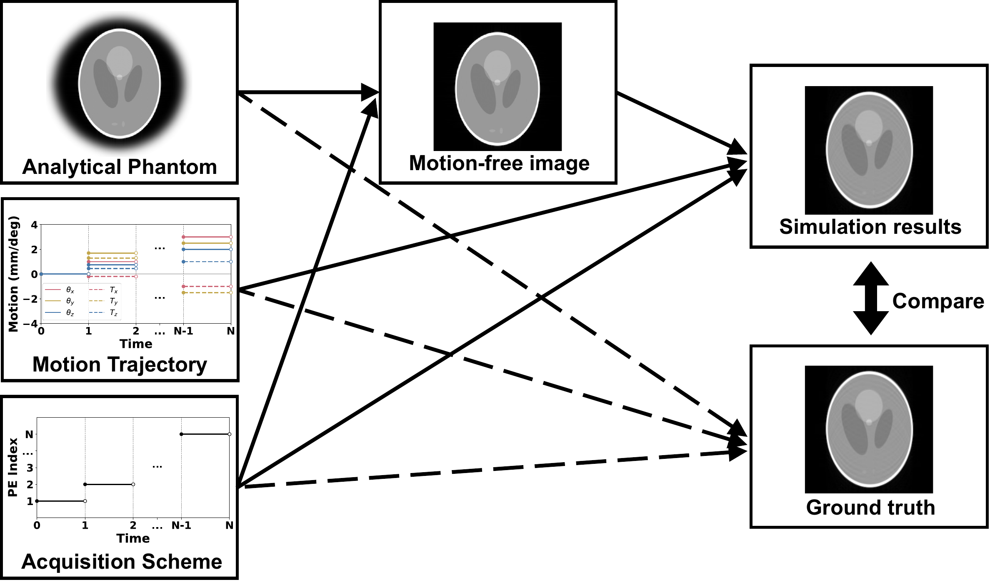

# APHABAMAS

**An analytical phantom-based scheme for assessing the accuracy of high-resolution 3D MRI motion-artifact simulations** [[1]](https://arxiv.org/abs/2607.09945)

Simulated motion-corrupted MRI is widely used to develop motion detection and correction methods. Yet different simulation algorithms produce different, visually plausible artifacts from the same inputs. How can we tell which is more accurate?

## The assessment scheme

APHABAMAS uses an analytical phantom [[2]](https://onlinelibrary.wiley.com/doi/10.1002/mrm.21292) to compute a ground-truth simulation free from sampling-induced error. The algorithm under assessment receives the phantom's motion-free image; both paths use identical motion and acquisition parameters. Comparing their outputs measures simulation accuracy.

## Experiments and figures

The experiments follow two phases:

1. **Demonstrate the need for assessment.** Show that algorithms produce different artifacts on brain and phantom images, even when all outputs look plausible.
2. **Evaluate simulation accuracy.** Compare phantom simulations with analytical ground truth to quantify image and signal errors.

All experiment code is in [experiments/](experiments/). Figure
generators and saved figures are in [manuscript_figures/](manuscript_figures/).

Across the evaluated motion conditions, **Type-2 NUFFT gives the most consistent
agreement with ground truth**. Image-based simulations generally show more
blurring, while Type-1 NUFFT accuracy deteriorates with increasing motion
severity.

## References

If you use **APHABAMAS** for your work, please cite [1] (and potentially also [2]).

[1] Wu T and Zhang H. APHABAMAS: An analytical phantom-based scheme for assessing
the accuracy of high-resolution 3D MRI motion-artifact simulations. [arXiv:2607.09945](https://arxiv.org/abs/2607.09945).

[2] Koay CG, Sarlls JE, Özarslan E. Three-dimensional analytical magnetic
resonance imaging phantom in the Fourier domain. *Magnetic Resonance in Medicine*.
2007;58(2):430–436. [doi:10.1002/mrm.21292](https://onlinelibrary.wiley.com/doi/10.1002/mrm.21292).
